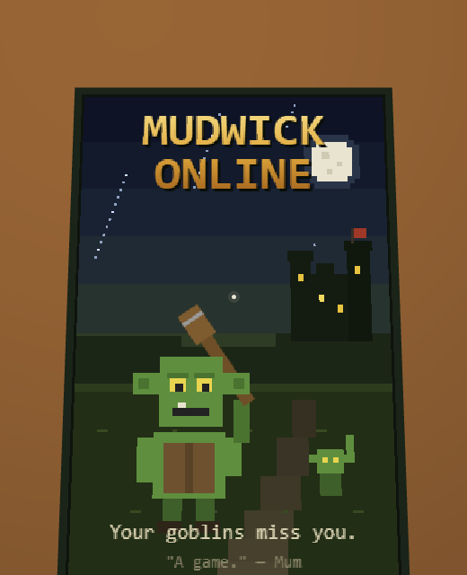
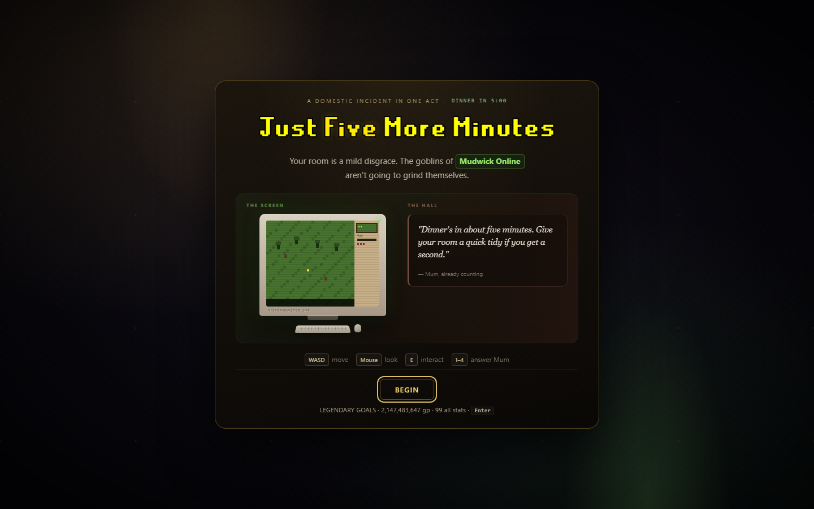
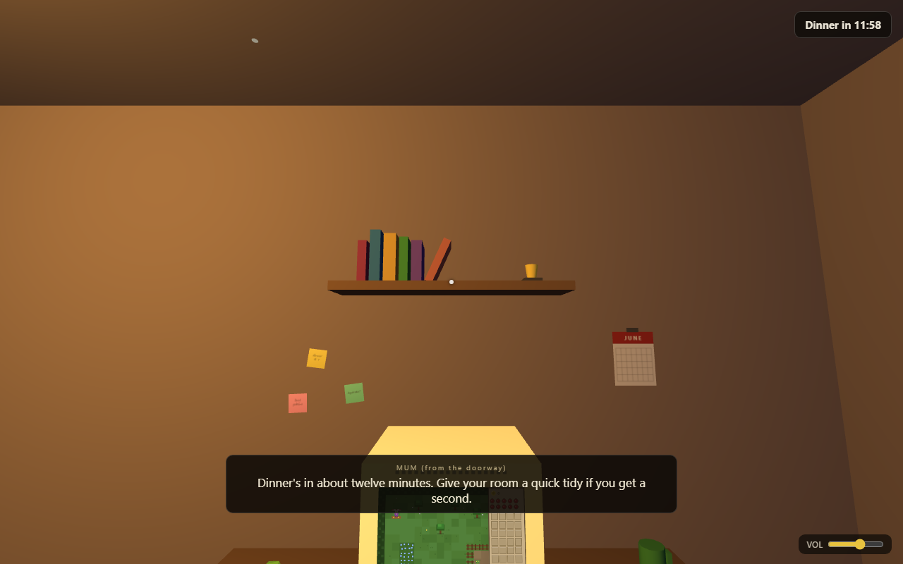
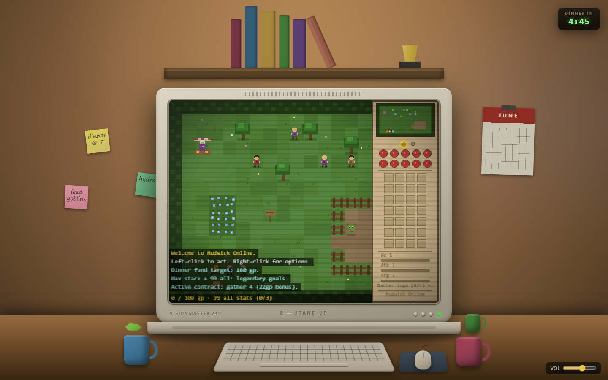
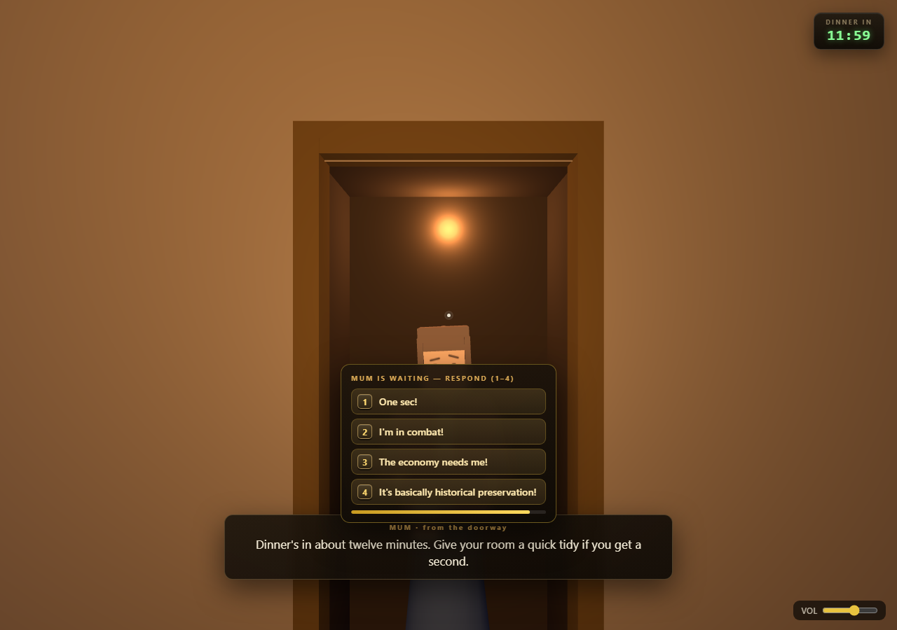
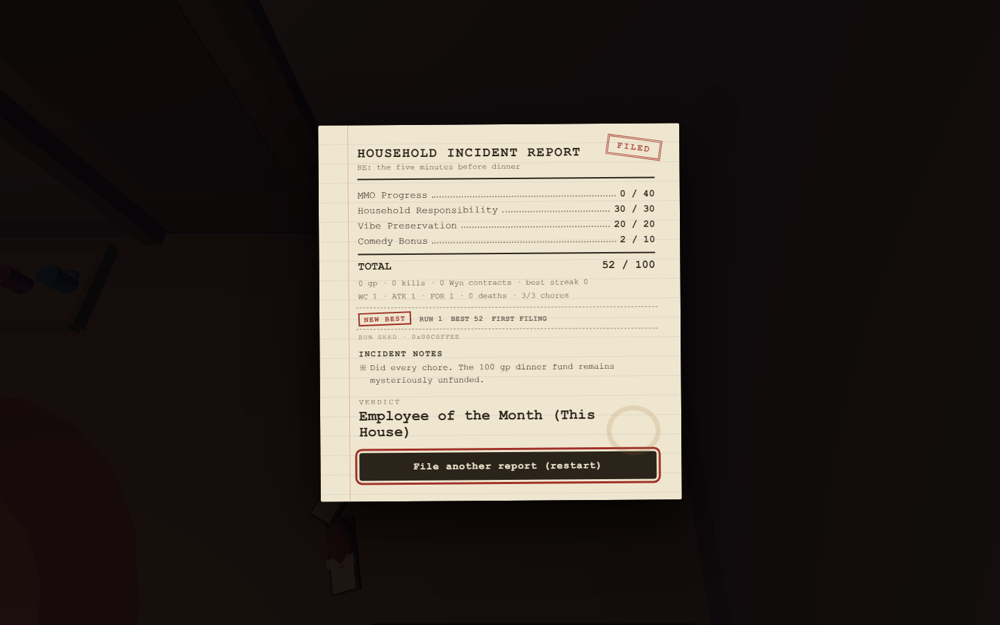
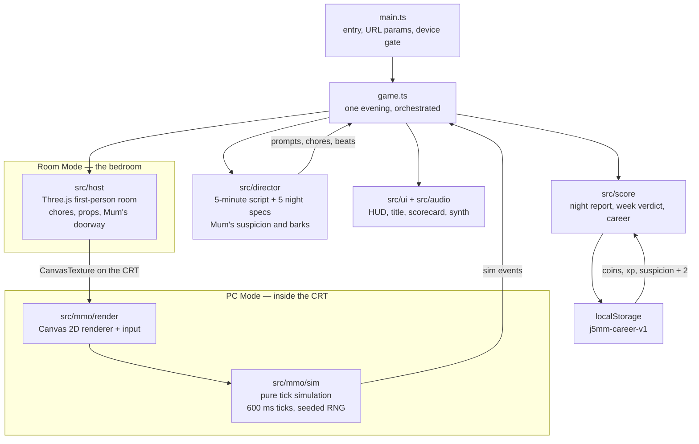
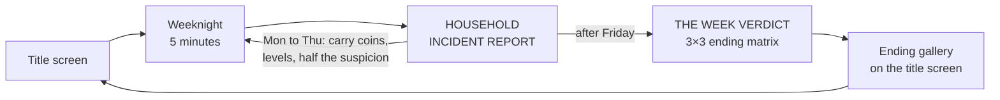

# Just Five More Minutes

<!-- ste-lint: off -->
[](https://github.com/Giftedx/just-five-more-minutes/actions/workflows/ci.yml)
[](LICENSE)
<!-- ste-lint: on -->

**[▶ Play in your browser](https://ha.ggis.xyz/just-five-more-minutes/)**. No install, no login, no microtransactions. Just goblins.

Also on [Cloudflare Pages](https://just-five-more-minutes.pages.dev/) if you prefer the direct link.

Dinner is in five minutes, and your room is a mild disgrace. Unfortunately, the goblins of **Mudwick Online**, a lovingly stupid 2004-flavoured mini-MMO inside your bedroom PC, are not going to grind themselves.

Walk around your room in first person. Sit at the CRT to click goblins and chop allegedly wood-bearing trees. Sell flax to a man who has seen your spreadsheet and is not impressed. Meanwhile, a very reasonable voice at the door asks you, three separate times, to do extremely small chores.

It's also not just one evening any more. It's **the School Week**: five weeknight acts, Monday to Friday, each five minutes long. Your Mudwick character persists between nights. Coins, levels, and the bridge toll you paid on Tuesday all carry forward. So does Mum's suspicion, at half strength, because she sleeps on it. Friday ends with the whole week stapled together and judged.

The week escalates. Tuesday the bed needs making. **Wednesday, Auntie Carol calls and the modem dies mid-combat.** You cannot log out in combat. Those were the rules in 2004, and they are the rules now. Thursday, Mum has noticed things. If her suspicion runs high enough, she comes in for an inspection. Press **F** to flip the CRT to `homework.doc`, the oldest trick in the book. Friday the Hendersons are coming, the wrapper count is up, and Mudwick is running double XP, which is torture.

Mudwick itself grew a far bank. Pay the 10 gp toll once and it is yours forever. Over there: oaks worth 15 gp (Woodcutting 5), and hobgoblins that hit harder and start fights on their own. A fishing spot too, and a campfire that turns raw shrimp into either food or regret. Dying drops your inventory at a gravestone for sixty seconds. The corpse run or the laundry: that choice sits between you and your conscience. Before you leave the PC, set your **standing orders**: keep working, eat at low health, run home, sell when full. Four toggles of period-authentic auto-piloting, all off by default, because walking away mid-combat is a personal choice.

Mum, meanwhile, keeps score in her own way. Every excuse now does something. "One sec!" buys you fifteen real seconds and one unit of lie-debt. "I'm in combat!" is oddly honest and calms her. "The economy needs me!" only lands if you have receipts. The historical preservation defence works exactly once a week. Ignore her and the **MUM:** chip in the corner climbs from *unbothered* to *at the door*.

After each five minutes you receive a typewritten **HOUSEHOLD INCIDENT REPORT**. It grades MMO progress (a milestone ladder of what you earned *tonight*), household responsibility, vibe preservation, and comedy output. After Friday's report comes **THE WEEK VERDICT**, a 3×3 matrix of endings from *The Lost Week* to *Time Wizard*. It awards stamps for perfect chores, reliable economies, and lies that were never one sec. Endings collect in a gallery on the title screen. Everything lives in a small local career file. No account, no analytics.

The game generates everything at runtime except the bundled third-party fonts. The only bundled runtime asset files are `public/fonts/RuneScape.woff2` and `public/fonts/RuneScape-Bold.woff2`.

<!-- ste-lint: off -->
<p align="center">
  
</p>
<!-- ste-lint: on -->

## Screenshots

<!-- ste-lint: off -->
<table>
  <tr>
    <td align="center" colspan="2"><br><sub>One domestic incident, five minutes, several terrible priorities</sub></td>
  </tr>
  <tr>
    <td align="center"><br><sub>Room Mode — the desk, the dread, the deadline</sub></td>
    <td align="center"><br><sub>PC Mode — grind goblins, ignore chores</sub></td>
  </tr>
  <tr>
    <td align="center"><br><sub>Mum — reasonable, persistent, unimpressed</sub></td>
    <td align="center"><br><sub>Scorecard — filed, stamped, judged</sub></td>
  </tr>
</table>
<!-- ste-lint: on -->

## Controls

| Input | Action |
|---|---|
| `WASD` | Move (Room Mode) |
| Mouse | Look (Room Mode) / play Mudwick (PC Mode) |
| `E` | Interact: pick up, place, tug straight, sit at the PC / stand up from the PC |
| `F` | Panic — flip the CRT to `homework.doc` (defuses inspections) |
| `1`–`4` | Answer the voice at the door (works in both modes) |
| Left click (Mudwick) | Default action — Attack / Chop / Fish / Pick / Trade / Walk here |
| Right click (Mudwick) | Context menu, including Examine. This is non-negotiable. |
| `AWAY PLAN` chips (Mudwick) | Toggle standing orders for while you're off doing chores |

The game needs a mouse, a keyboard, and a browser window at least 900 pixels wide. On other devices it shows an equipment-check screen instead. Mudwick had system requirements in 2004 too.

## How it works

The page contains two games and a boundary between them.

**Room Mode** is a first-person bedroom built with Three.js. All geometry and textures are procedural. **PC Mode** is Mudwick Online: a Canvas 2D renderer on top of a pure simulation that ticks every 600 ms with a seeded RNG.

One canvas backs both views. In PC Mode you play Mudwick directly. In Room Mode, a `THREE.CanvasTexture` maps the same canvas onto the CRT screen, and the simulation keeps ticking while you carry mugs. That is the whole joke, and it is also the architecture.



`game.ts` runs one evening. The director (`src/director/`) is pure code with no DOM and no timers. It scripts the five-minute timeline, fires the three chore requests, and supplies each night's beats: the Wednesday phone call, the Thursday knock, Friday's double XP. Mum's suspicion model and her ambient lines live beside it. When the clock runs out, `src/score/` grades the night and saves the career file. After Friday it computes the week verdict.



Where things live:

| Path | Contents |
|---|---|
| `src/game.ts` | The evening orchestrator: modes, prompts, excuses, scoring handoff |
| `src/host/` | The Three.js bedroom: room, player, chores, interaction, Mum's doorway |
| `src/mmo/sim/` | The Mudwick simulation: pure, seeded, fully unit-tested |
| `src/mmo/render/` | The Canvas 2D renderer and pointer input for Mudwick |
| `src/director/` | The five-minute script, the five night specs, Mum's suspicion model |
| `src/score/` | Night report, week verdict, ending matrix, career persistence |
| `src/ui/` | HUD, title screen, scorecard, device gate |
| `src/audio/` | Procedural Web Audio synth, including an abridged 56k handshake |

## Tech

| Layer | Stack |
|---|---|
| 3D bedroom | [Three.js](https://threejs.org/) · procedural geometry & textures |
| Mini-MMO | Canvas 2D · custom tick sim inspired by old-school MMOs |
| Audio | Web Audio API · procedural synth |
| Build | [Vite](https://vite.dev/) · TypeScript · [Vitest](https://vitest.dev/) |

The game is a single static bundle: no backend, no CDN assets, no analytics.

## Local development

```bash
git clone https://github.com/Giftedx/just-five-more-minutes.git
cd just-five-more-minutes
npm install
npm run dev        # dev server at http://localhost:5173
npm test           # vitest — director, nights, score, week, career, sim, chores, input
npm run build      # tsc --noEmit && vite build -> dist/
npm run size:check # verify compressed JS/CSS budgets for the current dist/
npm run test:browser  # managed standalone preview + isolated smoke + one full interaction E2E per weeknight
npm run test:artifact # focused resource/boot smoke for the current standalone dist/
npm run verify        # full standalone + browser + mounted + final standalone artifact gate
npm run preview       # serve the standalone dist/ left by build or verify
```

Dev affordances (query params):

| Param | Effect |
|---|---|
| `?speed=N` | Multiply the session clock and sim tick rate (e.g. `?speed=10`) |
| `?t=SECONDS` | Seed the session clock (e.g. `?t=250` to jump near dinner) |
| `?seed=N` | Reproduce a run with a decimal or `0x`-prefixed integer seed (the report shows a copy-ready form such as `0x00C0FFEE`) |
| `?night=N` | Play a specific weeknight, 0 (Monday) to 4 (Friday), ignoring the career pointer |
| `?skipTitle=1` | Auto-start without the title screen |
| `?dev=mmo` | Standalone Mudwick dev route |
| `?dev=room` | Standalone bedroom dev route |
| `?dev=host` | Standalone mode-switching dev route |

Browser checks need Playwright's Chromium installed once (`npx playwright install chromium`). `npm run test:browser` starts and owns a strict local preview of the current standalone `dist/`. It runs the isolated smoke plus one full interaction E2E per weeknight (select a subset with e.g. `--nights=0,4`), and stops the preview even if a check fails. `npm run test:artifact` is the focused resource and boot probe for a current standalone build. The complete `npm run verify` gate validates standalone behavior, then a mounted `/just-five-more-minutes/` build at its real base path. It then rebuilds and revalidates standalone `dist/`, so `npm run preview` works at the documented root afterward.

## Deploying

The live build is on **ha.ggis.xyz**: https://ha.ggis.xyz/just-five-more-minutes/

The old `just-five-more-minutes.pages.dev` URL redirects there automatically.

The build is fully static and self-contained (`base: './'`, no network assets). Connect the repo in the Cloudflare dashboard, or deploy from the CLI:

| Setting | Value |
|---|---|
| Framework preset | **None** |
| Build command | `npm run build` |
| Build output directory | `dist` |

```bash
npm run build
npx wrangler pages deploy dist --project-name=just-five-more-minutes
```

## Contributing

Bug reports and ideas are welcome. Use the issue templates. For code changes, fork, branch, and open a PR. See [CONTRIBUTING.md](CONTRIBUTING.md) for the short version.

## License

[MIT](LICENSE). Do what you like, but Mum would like you to tidy the place after yourself.
